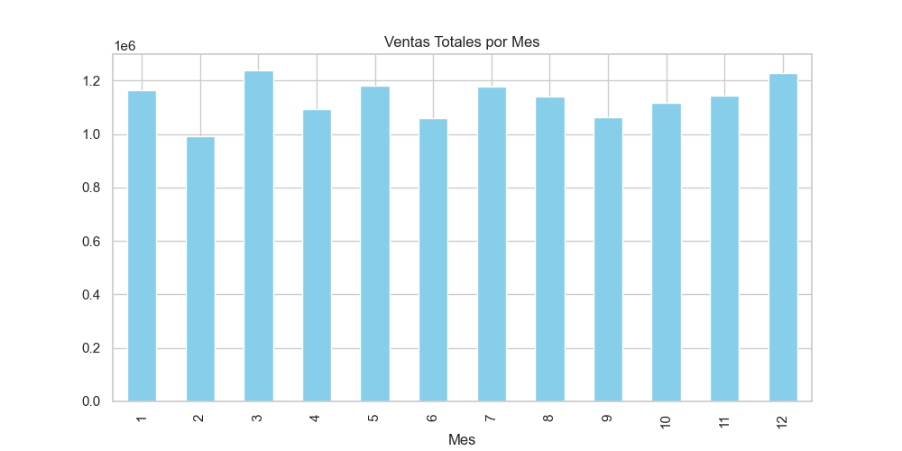
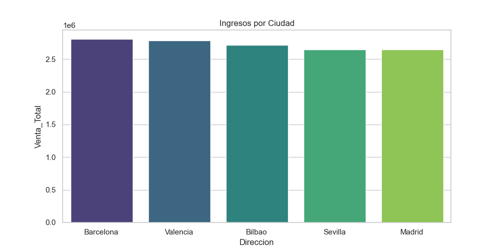

# 📊 Análisis de Ventas Retail: Caso ElectroTech

Este proyecto realiza un análisis end-to-end de los datos de ventas de una empresa de tecnología. El objetivo es transformar datos crudos en información estratégica para la toma de decisiones gerenciales.

## 🎯 Objetivos del Proyecto
* **Limpieza de Datos:** Tratamiento de valores nulos y corrección de tipos de datos.
* **Ingeniería de Características:** Creación de métricas de ventas totales y segmentación por mes.
* **Análisis Exploratorio (EDA):** Identificación de tendencias temporales y rendimiento por ubicación geográfica.

## 🛠️ Tecnologías Utilizadas
* **Lenguaje:** Python 3.x
* **Librerías:** * `Pandas`: Manipulación y limpieza de datos.
    * `Matplotlib` & `Seaborn`: Visualización de datos.
    * `Jupyter Notebooks`: Entorno de desarrollo interactivo.

## 📈 Hallazgos Clave
Tras analizar 10,000 registros de ventas, se determinaron los siguientes puntos:

1.  **Mejor Mes:** Marzo se consolidó como el mes con mayores ingresos.
2.  **Líder Regional:** La ciudad de Barcelona encabeza las ventas totales.
3.  **Calidad de Datos:** Se identificaron y eliminaron un 5% de registros con datos faltantes para asegurar la integridad del análisis.

## 🖼️ Visualizaciones

### Ventas Mensuales

### Rendimiento por Ciudad

## 🚀 Cómo ejecutar el proyecto
1. Clonar el repositorio.
2. Crear un entorno virtual: `py -m venv venv`
3. Activar el entorno: `.\venv\Scripts\activate`
4. Instalar dependencias: `pip install -r requirements.txt`
5. Ejecutar los notebooks en la carpeta `/notebooks`.