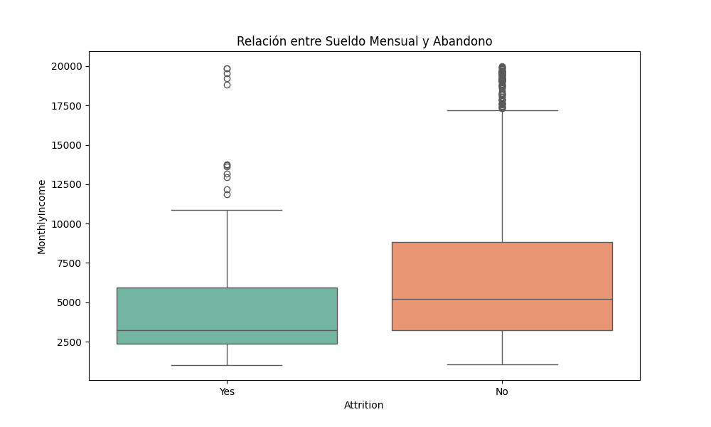
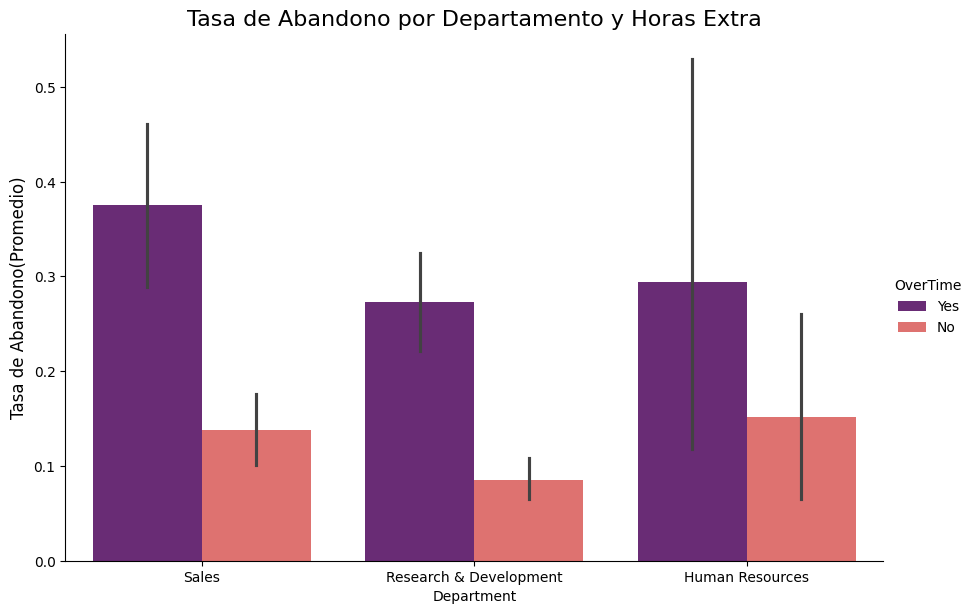

# 📊 Análisis de Retención de Talento - IBM HR

Este proyecto analiza los factores que influyen en la deserción laboral (Attrition) utilizando el dataset real de IBM.

## 🎯 Hallazgos Principales (Insights)

* **Impacto del Salario:** Los empleados que renuncian tienen una mediana salarial significativamente menor (aprox. 3,000 USD) frente a los que permanecen (aprox. 5,000 USD).
* **El factor Horas Extra:** Trabajar horas extra triplica la tasa de abandono, elevándola del **10% al 30%**.
* **Segmentación Crítica:** El departamento de **Ventas** es el más afectado por la rotación cuando se requiere tiempo extra, alcanzando casi un **40% de fuga**.

## 🛠️ Herramientas utilizadas
* **Python** (Pandas para manipulación).
* **Seaborn & Matplotlib** (Análisis multivariado).
* **Estadística Descriptiva.**

## 📈 Visualizaciones Clave

### 1. Relación Salarial
Los empleados que abandonan la empresa tienen una base salarial mucho más baja.

### 2. El Impacto de las Horas Extra por Departamento
Ventas es el departamento donde el agotamiento impacta más fuerte en la renuncia.
