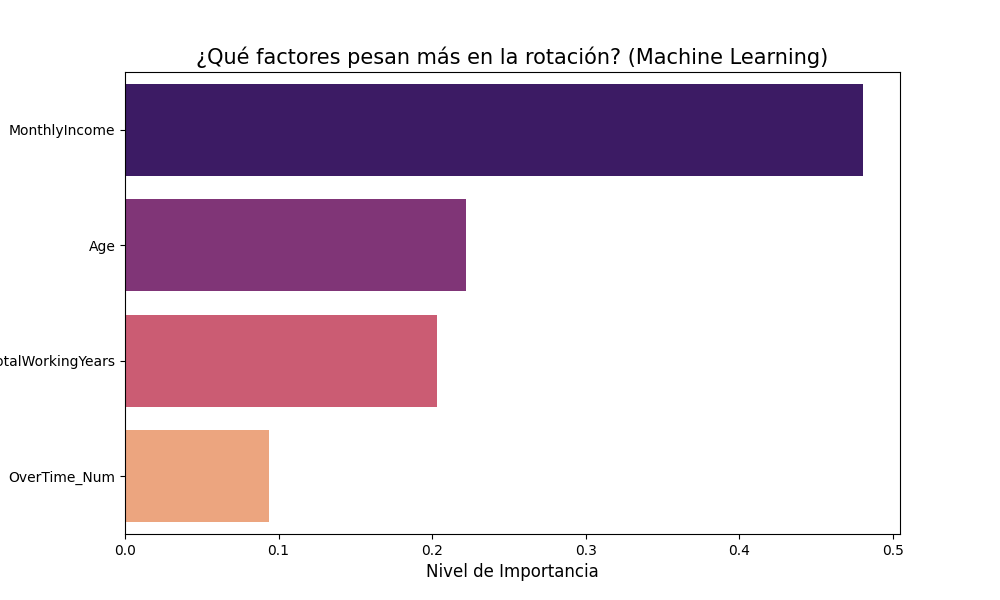

# 🤖 Predicción de Rotación de Personal con Machine Learning

En este tercer proyecto, evolucionamos del análisis exploratorio a la **Ciencia de Datos Predictiva**. El objetivo es construir un modelo capaz de identificar patrones de renuncia y predecir qué empleados tienen mayor riesgo de abandonar la empresa.

## 🧠 Metodología del Modelo
* **Algoritmo utilizado:** Random Forest Classifier (Bosque Aleatorio).
* **Estrategia de validación:** División de datos 80/20 (80% entrenamiento, 20% prueba).
* **Variables seleccionadas (Features):** Edad, Ingreso Mensual, Horas Extra y Años Totales de Experiencia.

## 📊 Resultados de la IA
El modelo alcanzó una **Precisión (Accuracy) del 81%** en sus predicciones generales. 

### Factores Críticos (Feature Importance)
A través del modelo, logramos identificar matemáticamente qué variables influyen más en la decisión de un empleado:

* **Sueldo (MonthlyIncome):** Confirmado como el factor de mayor peso para la inteligencia artificial.
* **Edad y Experiencia:** El modelo detecta que la etapa de carrera es un predictor clave de estabilidad.

## 🛠️ Herramientas de Machine Learning
* **Scikit-Learn:** Para el preprocesamiento de datos, entrenamiento del modelo y evaluación de métricas.
* **Pandas:** Transformación de variables categóricas a numéricas.
* **Matplotlib & Seaborn:** Visualización de la jerarquía de importancia de variables.

## 🚀 Conclusión de Negocio
Aunque el modelo es excelente prediciendo quién se queda, el siguiente paso técnico sería balancear los datos (SMOTE) para mejorar la detección de renuncias. Este proyecto demuestra la capacidad de utilizar IA para generar estrategias de retención preventivas en lugar de reactivas.