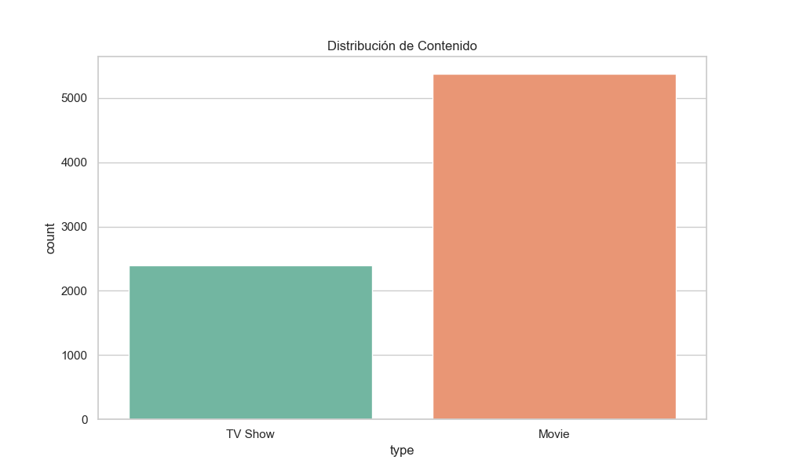
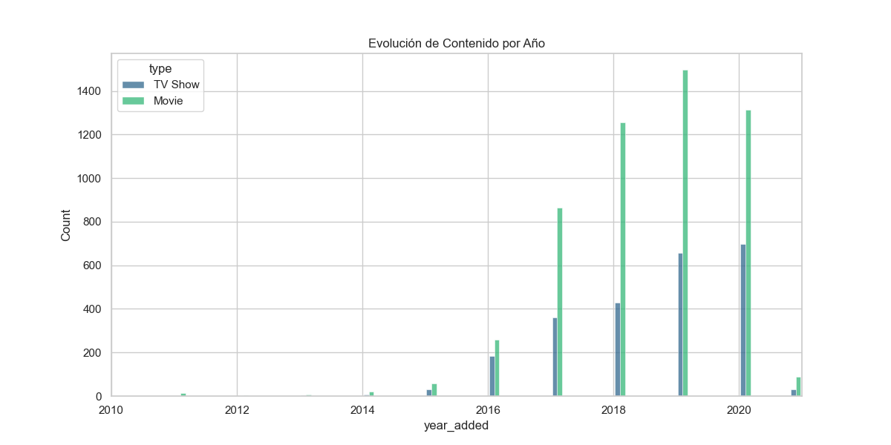
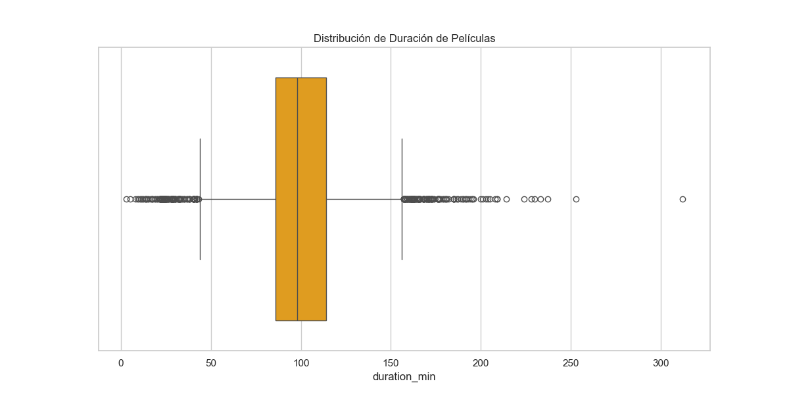

# 📊 Análisis Estratégico del Catálogo de Netflix

**Autor:** Brian Pardo
**Fecha:** Enero 2026
**Herramientas:** Python, Pandas, Seaborn

---

## 1. Resumen Ejecutivo
El objetivo de este proyecto fue analizar el dataset de Netflix (más de 7,700 títulos) para identificar tendencias de contenido y estrategia de mercado. Los datos fueron limpiados y procesados para corregir problemas de calidad (nulos en directores y formatos de fecha incorrectos).

**Hallazgo Principal:** Netflix mantiene una estrategia histórica centrada en **Películas (69%)**, pero desde 2019 se observa una desaceleración en la adquisición de cine y un sostenimiento en la producción de Series de TV, equilibrando la oferta reciente.

---

## 2. Distribución del Catálogo
Analizamos la proporción actual entre películas y series.

* **Películas:** ~5,400 títulos.
* **Series:** ~2,400 títulos.
* **Insight:** La biblioteca histórica es predominantemente cinematográfica. Por cada serie, hay aproximadamente 2.3 películas disponibles.

---

## 3. Evolución Temporal (La "Guerra del Streaming")
Al visualizar el contenido agregado año con año, detectamos el punto de inflexión en la estrategia.

* **Crecimiento Explosivo (2016-2019):** Se observa un pico masivo en la adquisición de licencias, coincidiendo con la expansión global de la plataforma.
* **Cambio de Tendencia (2020-2021):** La brecha entre Películas (Verde) y Series (Azul) se cierra. Mientras las películas decrecen, las series mantienen un ritmo constante, sugiriendo una estrategia de retención de usuarios a largo plazo.

---

## 4. Análisis de Duración (Estándar de la Industria)
Analizamos la duración de las películas para entender el formato estándar.

* **Duración Mediana:** 98 minutos.
* **Rango Normal:** La mayoría de las películas duran entre 86 y 114 minutos.
* **Outliers:** Existen títulos extremos (más de 3 horas) que representan nichos específicos (documentales o cine internacional), pero no son la norma comercial.

---

## 5. Conclusión Técnica
El proceso de ETL (Extracción, Transformación y Carga) reveló que el 30% de los datos originales carecían de información de director, lo cual fue imputado como "Desconocido". La calidad de los datos temporales es robusta a partir del año 2010.