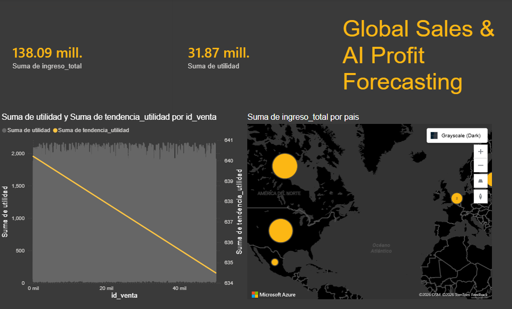

# 📈 Global Sales Intelligence & AI Predictive Dashboard

Este proyecto demuestra una integración completa de **Data Engineering**, **Data Science** y **Business Intelligence**. Transformé un conjunto de datos bruto de 50,000 registros en un panel de control interactivo con análisis predictivo.

## 📊 Vista Previa del Proyecto

## 🚀 Características Principales
* **Procesamiento de Big Data:** Manejo de 50,000+ filas mediante Python y SQLite.
* **Inteligencia Artificial:** Implementación de un modelo de tendencia lineal para predecir la utilidad de ventas.
* **Visualización Avanzada:** Dashboard en modo oscuro utilizando Azure Maps para geolocalización global y KPIs en tiempo real.

## 🛠️ Tecnologías Utilizadas
* **Python:** Procesamiento de datos (Pandas) y lógica de negocio.
* **SQL (SQLite):** Almacenamiento y estructuración de datos.
* **Power BI:** Diseño de experiencia de usuario (UX) y visualización de datos.
* **Azure Maps:** Integración de inteligencia geográfica.

## 📁 Estructura del Repositorio
* `/scripts`: Código fuente en Python para la limpieza y análisis de datos.
* `/data`: Base de datos procesada lista para BI.
* `*.pbix`: Archivo fuente del Dashboard de Power BI.

---
**Desarrollado por Brian Pardo** | Especialista en Análisis de Datos e IA